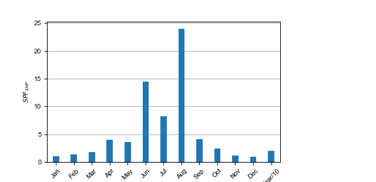
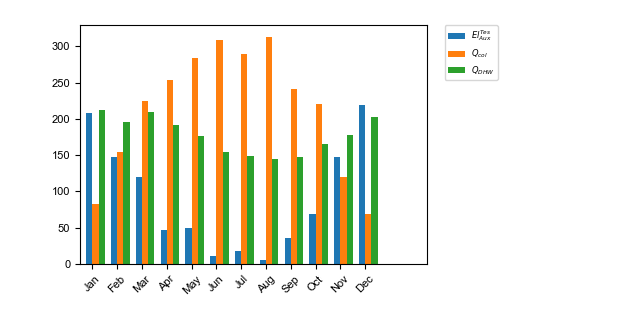
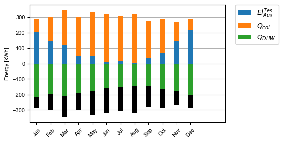
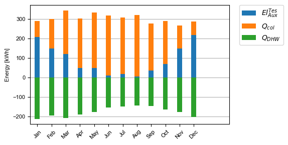
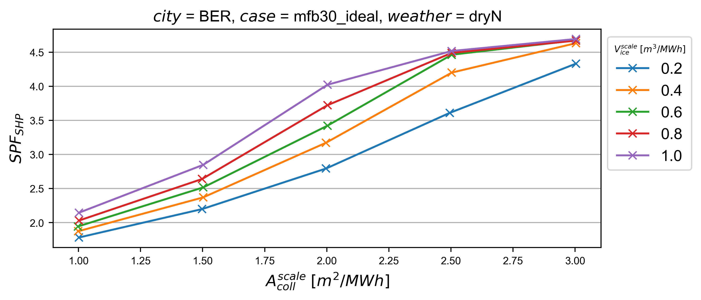
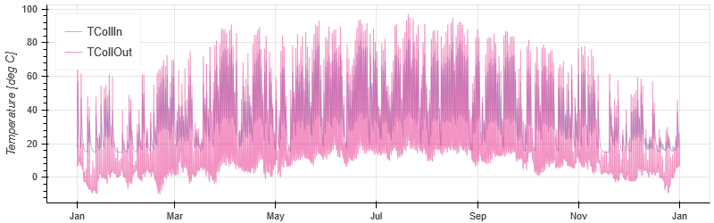

.. _config_file:

The pytrnsys configuration files
================================

Pytrnsys runs and processes TRNSYS simulations based on configuration files. The general idea behind this is to provide
a fast and easily accessible way to define, run and analyse both single simulations as well as parametric studies. There
are distinct configuration files for running and processing. Both are described in the subsequent sections but follow
the same syntax and format.

Configuration file format
*************************

The configuration file does not require a header. It should contain different keyword commands on single lines.
Comments start with ``#`` characters. End of line comments are possbile.

The config file supports the following basic types:

==========================  ===================================
*bool*                      with True/False as possible value
*int*                       with any interger as possible value
*string*                    with any string as possible value
*stringArray*               array of strings
==========================  ===================================

Parameters that are used to specifiy the run can be defined by::

    keyword parameter_name value

In the case of an integer this would for example be::

    int reduceCpu  4

.. note::

   The ``string`` and ``stringArray`` always have to be specified with parentheses.

Run configuration file
**********************
Ddck section
------------

The core of the run configuration file is the ddck section. In this part of the configuration
file, the different modular ddck files that should be used in the simulation are specified.
Pytrnsys offers its own ddck repository in the separate package pytrnsys_ddck that is installed
together with the main package and used in the example projects of pytrnsys_examples. In the ddck section
of the config file, the different ddcks that should be merged to the simulation's main dck file
are specified according to the following syntax::

    ROOTPATH1$ pathtoddck1\ddck1
    ROOTPATH1$ pathtoddck2\ddck2
    ROOTPATH2$ pathtoddck3\ddck3

The root of the ddck repositories used has to be defined elsewhere in the configuration file::

    string ROOTPATH1$ "pathToTheRepository1Root"
    string ROOTPATH2$ "pathToTheRepository2Root"

An example can be found in the example section below. The path to the repository root can be either
absolute or relative. If a relative path is detected, pytrnsys will interpret it as relative to
the configuration file location.

Parameter variation section
---------------------------

A second core feature of pytrnsys is activated in the run configuration file in a parameter
variation section. Pytrnsys allows either to modify TRNSYS simulation parameters in the configuration
file statically or with variations that result in parametric runs. A static parameter change
that can affect TRNSYS variables that are defined in EQUATIONS or in CONSTANTS blocks of the dck file
are initiated by::

    deck trnsysVariableName value

A parametric study is defined by::

    variation trnsysVariableName value1 value2 value3 ...

Both keywords can be used multiple times. If multiple variations are used, they are combined
depending on the parameter ``combineAllCases``. If this parameter is set to True all variations
are combined pairwise. So if n values are given for variation 1 and m values are in variation 2
the total amount of simulations executed will be (m x n). If ``combineAllCases`` is set to false,
the amount of values of all variations has to be equal and they are combined according to their order.

.. _ref-changeDDckFile:

In addition to a single equation or constant line in the dck, pytrnsys offers the possibility to
loop through different ddck files during a parametric study. A parametric study on ddck files can be defined by::

    changeDDckFile originalDdck ddckVariation1 ddckVariation2 ddckVariation3 ...

Parameters
----------

There are different additional parameters that define the simulation runs. The ones that have no
default values are mandatory.

Generic
^^^^^^^^

``ignoreOnlinePlotter`` (bool, default False)
    If set to True, the TRNSYS online plotters are commented out in all the dck-files. No online plotters
    are shown during the simulation run. The TRNSYS progress bar window is still displayed.

``removePopUpWindow`` (bool, default False)
    Online plotters as well as the progress bar window are suppressed during the simulations.
    (TRNSYS hidden mode)

``checkDeck`` (bool, default True)
    If set to True, during merging the ddck-files, the specified and given amount of Equations and Parameters in
    each block are checked for inconsistencies.

``parseFileCreated`` (bool, default True)
    Saves the parsed dck-file that can be used to locate the line where ``checkDeck`` found errors.

``runCases`` (bool, default True)
    If set to False, the dck-files are created and saved in the normal structure but not executed.

``reduceCpu`` (int, default 0)
    Number of CPUs that are not used in the parallel simulation runs.

``outputLevel`` (string, default "INFO")
    Output message level according to the logging package. (Options are "DEBUG", "INFO", "WARNING", "ERROR", and
    "CRITICAL".)

Automatic Work Bool
^^^^^^^^^^^^^^^^^^^
.. _doAutoUnitNumbering:

``doAutoUnitNumbering`` (bool, default True)
    If set to True, the units of the merged dck-file are renumbered to avoid duplicates. This parameter
    should usually be set to the default True.

.. _generateUnitTypesUsed:

``generateUnitTypesUsed`` (bool, default True)
    If set to True, a file called ``UnitType.info`` containing the TRNSYS-Type numbers used is saved in the main run-folder.

.. _addAutomaticEnergyBalance:

``addAutomaticEnergyBalance`` (bool, default True)
    If set to True, an automatic energy balance printer is created in the dck file. For more information
    see :ref:`ref-defaultPlotting`.

Paths
^^^^^

``trnsysExePath`` (string, default "environmentalVariable")
    Path to the ``TRNExe.exe`` of the TRNSYS installation. If not set, pytrnsys tries to
    find the path in the system environmental variable "TRNSYS_EXE".

``pathBaseSimulations`` (string)
    If specified, the location of the simulation run is changed to the given path.
    It overrules the normal behavior of executing the simulations in the command line
    working directory.

.. _ref-addResultsFolder:

``addResultsFolder`` (string or False, default False)
    If specified as a string, a new folder for the simulations is created with this name.

Scaling
^^^^^^^

.. _ref-scaling:

``scaling`` (("False","toDemand"), default False)
    If set to "toDemand" the parameter scaling functionality is activated. Please refer to
    :ref:`scaling tutorial <ref-scalingTutorial>` for more details.

.. _ref-scalingReference:

``scalingReference`` (string)
   Path to the scaling results. Please refer to
   :ref:`scaling tutorial <ref-scalingTutorial>` for more details.

.. _ref-scalingVariable:

``scalingVariable`` (string)
   Variable that is taken from the results json file for scaling. Please refer to
   :ref:`scaling tutorial <ref-scalingTutorial>` for more details.

``nameRef`` (string)
    Base name of the dck-file created. Default base name is "pytrnsysRun".

``runType`` (("runFromConfig", "runFromCases", "runFromFolder"), default "runFromConfig")
    "runFromCases" and "runFromFolder" offer some advanced option for custom simulation runs.

Example
-------
Here is an example of a run configuration file.
It is taken from the example project solar_dhw (``run_solar_dhw.config``)::

    ######### Generic ########################
    bool ignoreOnlinePlotter  True
    int reduceCpu  4
    bool parseFileCreated True
    bool runCases True
    bool checkDeck True

    ############# AUTOMATIC WORK BOOL##############################

    bool doAutoUnitNumbering True
    bool generateUnitTypesUsed True
    bool addAutomaticEnergyBalance True

    #############PATHS################################

    string trnsysExePath "C:\Trnsys17\Exe\TRNExe.exe"
    string addResultsFolder "solar_dhw"
    string PYTRNSYS$ "..\..\pytrnsys_ddck\"
    string LOCAL$ ".\"

    ################SCALING#########################

    string scaling "False" #"toDemand"
    string nameRef "SFH_DHW"
    string runType "runFromConfig"

    #############PARAMETRIC VARIATIONS##################

    bool combineAllCases True
    variation Ac AcollAp 2 3 4 6 8 10
    variation VTes volPerM2Col 75 100

    #############FIXED CHANGED IN DDCK##################

    deck START 0    # 0 is midnight new year
    deck STOP  8760 #
    deck sizeAux 3

    #############USED DDCKs##################

    PYTRNSYS$ generic\head
    PYTRNSYS$ demands\dhw\dhw_sfh_task44
    PYTRNSYS$ weather\weather_data_base
    PYTRNSYS$ weather\SIA\normal\CitySMA_dryN
    PYTRNSYS$ solar_collector\type1\database\type1_constants_CobraAK2_8V
    PYTRNSYS$ solar_collector\type1\type1
    LOCAL$ solar_dhw_control
    LOCAL$ solar_dhw_storage1
    LOCAL$ solar_dhw_hydraulic
    LOCAL$ solar_dhw_control_plotter
    PYTRNSYS$ generic\end

Process configuration file
**************************

Pytrnsys processing modules automatically reads in the simulation results of the pytrnsys runs
and - by default - calculates energy balances as well as collects some of the most important
information of the simulation like iteration problems and system performance factors in a results
pdf file. The process configuration file allows to configure the processing. In addition
further calculations with the simulation results and additional plots can be defined.

Besides that, the processing functionality can be used on generic data that do not originate from
TRNSYS simulations.

Processing TRNSYS data
----------------------

During processing pytrnsys reads in the following values automatically:

1.  All parameter and equation variables that are statically defined in
    the dck.file. Pytrnsys recursively detects static variables by checking
    for any type outputs in the variables involved.

2.  All monthly printer values of the simulation. The pytrnsys ddcks save all
    printer files in the temp folder inside the directory where the simulation is
    executed. If custom printers are defined, the same location is required.

3.  All hourly printer values of the simulation.

All values can be adressed in the config file by their name in the header of the trnsys printer file.
It is recommended to duplicate the internal TRNSYS name in the header of the printer.

.. note::

    While TRNSYS is not case sensitive, Python is. So be careful about upper and lower cases
    during post processing. If the string in the configuration file does not match the header
    of the printer file or the TRNSYS name of the static parameter in the dck-file,
    pytrnsys will not be able to find the value and throw a key-error.

By default, pytrnsys also calculates the following values:

4.  Total yearly sum of the monthly printed values. The yearly sum of a monthly
    printed variable with the name ``foo`` can be accessed for further processing
    by ``foo_Tot``.

5.  The maximum hourly value of an hourly printed file. The hourly maximum of an hourly
    printed variable with the name ``bar`` can be accessed by ``bar_Max``.

Processing generic data
-----------------------

To process generic data, add the following expression to the header of your configuration file::

    bool isTrnsys False

You then need to specify how pytrnsys should access your data. One way is to identify a data set
with a json file that includes the parameters of the data set in the format of a python dictionary.
When you have such a json in each data set folder, you should use::

    string typeOfProcess "json"

Furthermore, you need to specify the folder (here, e.g.: ``dataFolder``) containing your data sets with::

    string pathBase "..\dataFolder"

The program will look for json-files in ``dataFolder`` and on each subfolder level. It will then
load csv-files, which are in the same folders as the json-files it found. At the moment it can load
hourly, daily, and monthly data. The names of the respective csv-files need to contain the keywords
``_Stunden``, ``_Tage``, or ``_Monat``.

Calculations
------------

In the processing-configuration file, the user can specify custom calculations based on the
readed TRNSYS results and the values that are calculated by default. The type of each equation has to be
defined by a key word that tells pytrnsys what values should be used. This is necessary since
some variables could be both in an hourly as well as a monthly printer. The following calculation keywords
are available:

``calc``
    Calculates a new scalar value out of other scalar values such as static TRNSYS parameters
    or yearly sums or hourly maxima.

``calcMonthly``
    Calculates new monthly values (array with length 12) out of other monthly values or scalar values.

``calcDaily``
    Calculates new daily values (array with length 365) out of other hourly values or scalar values.

``calcHourly``
    Calculates new hourly values (array with length 8760) out of other hourly values or scalar values.

``calcMonthlyFromHourly``
    Calculates new monthly values (array with length 12) out of hourly values or scalar values.

A calculations section could be of the following structure. A full working example can be
found in the example below::

    calc alpha = foo_Tot/bar_Max
    calcMonthly = foo/foo_Tot*1000
    calcHourly = (bar+100)**2

``acrossSetsCalc``
    Can execute calculations across data sets with variables from the results json-files. Equations
    are provided as arguments and indicated by a ``=`` and conditions by ``:`` and stated as
    ``key:value``. A function call (optional arguments in square brackets) then looks like::

        stringArray acrossSetsCalc "x-variable" "y-variable" "calculation variable" "equation 1" ["equation 2"] ... ["key 1:value 1"] ["key 2:value 2"] ...

    Here ``calculation variable`` is a key of the results json-files and specifies what arguments can
    go into an equation. An example for an equation looks like::

        nameOfValueToBeCalculated=(foo+bar)*100

    where ``foo`` and ``bar`` are valid values of the ``calculation variable``. The program will take
    different data sets with the same ``x``- and ``y``- but different ``calculation variable``-values
    and execute the equation for these. Hence, you need to ensure that these combination exist in
    your data sets. A csv with the calculated results will be generated.

Plotting
--------

.. _ref-defaultPlotting:

Default plotting for TRNSYS results
^^^^^^^^^^^^^^^^^^^^^^^^^^^^^^^^^^^
By default the processing creates a pdf with the following content:

1.  A table displaying the total simulation time and the number of iteration errors.

2.  A table with the monthly heat balance. The values are also shown in a plot, in the case
    of the solar domestic hot water example system this looks like the following:

.. image:: ./resources/HeatMonthly.png
      :width: 400
      :alt: Monthly heat balance

3.  A electricity balance similar to the heat balance.

4.  The system seasonal performance factor both in a table and a plot. Again, the SPF
    plot of the solar domestic hot water system looks like:

Custom plotting and printing
^^^^^^^^^^^^^^^^^^^^^^^^^^^^

The user can add additional monthly plots to the processing of a single simulation
run by the use of the following parameters. The custom defined plots will automatically
be added to the result pdf-file:

.. note::

    If an argument in the code excerpts below is set in square brackets, it is optional.

``monthlyBars``
    Plots a monthly bar plot that shows all variables grouped side by side.

``monthlyBalance``
    Custom monthly balance. The sign of the values can be inverted by adding a - in front of
    the variable name. If positive and negative values don't add up to zero, the imbalance
    is shown as black bars. When adding the optional ``style:relative`` the bars will be shown as
    values relative to the positive sum of the monthly energy values. To call the function the
    following statement needs to be added to the config-file::

        stringArray monthlyBalance "pdf name" ["style:relative"] "variable 1" "variable 2" ...

    In the solar domestic hot water example system this can be demonstrated
    by plotting the two system inputs :math:`Q_{col}` and :math:`El_{Aux}^{Tes}` and the usable
    output of the domestic hot water demand. The imbalance in this case are the overall losses of
    the system.

``monthlyStackedBar``
    Similar to the ``monthlyBalance`` but without showing the imbalance.

``fitHeatingLimit``
    This function was created to plot and fit heating power values against average daily
    temperatures. In principle it can plot any daily or hourly data against average daily
    temperature. The time resolution of the heating power data (or its equivalent) needs to be
    specified as ``daily`` or ``hourly`` when calling the function::

        string fitHeatingLimit "y-variable" "heatingDataTimeStep"

    A linear fit is done for ``daily``, while the data only are shown for ``hourly``.

.. image:: ./resources/fitHeatingLimit.png
      :width: 400
      :alt: SP

.. note::

    All variables used in ``comparePlot``, ``comparePlotConditional``, and
    ``acrossSetsCalculationsPlot`` need to be saved in the results json-files.

``comparePlot``
    When processing parametric runs, scalar results of the simulations can be visualized in
    comparison plots. The first variable of the string array is shown on the x-axis.
    The second variable is shown on the y-axis. The third is represented as different lines,
    and the fourth as different marker styles::

        stringArray comparePlot "x-variable" "y-variable" ["series 1 variable"] ["series 2 variable"]

``comparePlotConditional``
    Same as ``comparePlot``, but with the additional feature of imposing conditions on the data that
    is supposed to be plotted. For a ``key`` in the results json, a condition is indicated by a
    ``:`` and stated as ``key:value``::

        stringArray comparePlotConditional "x-variable" "y-variable" ["series 1 variable"] ["series 2 variable"] ["key 1:value 1"] ["key 2:value 2"] ...

``acrossSetsCalculationsPlot``
    Has the same basic functionality as ``acrossSetsCalc``, but can plot the results of
    equations provided::

        stringArray plotCalculationsAcrossSets "x-variable" "y-variable" "calculation variable" "equation 1" ["equation 2"] ... ["key 1:value 1"] ["key 2:value 2"] ...

``plotHourly``
    Hourly printed values can be displayed in a interactable html-plot that is created using the bokeh
    plotting library.

.. _ref-plotHourlyQvsT:

``plotHourlyQvsT``
    Adds a cumulative plot that contains a line for each heat temperature pair given in the string array.
    Used to show at what temperature levels the heat is released or consumed in different system components.
    Uses hourly printer files.

.. _ref-plotTimestepQvsT:

``plotTimestepQvsT``
    Adds a cumulative plot that contains a line for each heat temperature pair given in the string array.
    Used to show at what temperature levels the heat is released or consumed in different system componenets.
    Uses timestep printer files.

Results file
------------

For further custom processing of the simulation results, required scalar and monthly values
can be saved to a results json-file.

``results``
    Determines which variables should be stored in a dedicated json-file for each
    data set::

        stringArray results "variable 1" "variable 2" ...

``pathInfoToJson``
    Scans the paths of the generated ``-results.json``-files for keywords and adds
    them as the respective ``parameter name`` in said json-files, and adds an empty
    string, if it doesn't find any of the keys in the respective path::

        stringArray pathInfoToJson "parameter name" "key 1" "key 2" ...

Parameters
----------
There are different general parameters in the processing configuration file that allow to change
different settings

Generic
^^^^^^^^

``processParallel`` (bool, default True)
    If set to True, pytrnsys will process the simulation sub-folders in parallel. The amount of parallel
    processes will be the total amount of CPUs minus ``reduceCpu``.

``processQvsT`` (bool, default True)
    Flag to disable the QvsT processing. Since this is computationally very expensive it can be useful to
    disable the QvsT plots if not needed.

``cleanModeLatex`` (bool, default False)
    If set to True, all plot files will be deleted after they are collected in the results pdf-file. If set
    to False, they will remain in the simulation subfolder.

``forceProcess`` (bool, default True)
    If set to False, allready processed folders will not be processed again.

``plotStyle`` (string, default 'line')
    If set to 'dot', dots will be used instead of lines for the respective plots.

.. _ref-setPrintDataForGle:

``setPrintDataForGle`` (bool, default True)
    Print the Data of the plots for further use in GLE plots.

.. _ref-figureFormat:

``figureFormat`` (string, default 'pdf')
    Format in which the plots of the processing will be saved. All formats that are supported by `matplotlib.pyplot.savefig <https://matplotlib.org/3.1.1/api/_as_gen/matplotlib.pyplot.savefig.html>`
    are supported

.. _ref-plotEmf:

``plotEmf`` (bool, default False)
    If set to true, all plots will be exported in the emf format. Requires Inkscape.

Time selection
^^^^^^^^^^^^^^

Pytrnsys is designed to process one full year. If more than a year is simulated, the months that are used for
processing have to be specified.

``yearReadedInMonthlyFile`` (int, default -1)
    Year of the simulation that is used for processing. 0 is the first year, 1 the second year and so on.
    If the value is set to -1 pytrnsys will use the last 12 months of the simulation for processing.

``firstMonth`` (["January", "February", "Mach", ..., "December"], default "January")
    Month in the chosen year where the 12-month processing period begins. If the value is e.g. "November" November to October
    will be analysed.

Paths
^^^^^

``latexNames`` (string)
    Path to the latexNames json-file. Can either be an absolute path or a path relative to the configuration
    file. If not specified, the default latexName json-File of pytrnsys is used.

``pathBase`` (string)
    Path of the folder to be processed. If not specified, the current working directory is used instead.

.. _ref-inkscape:

``inkscape`` (string)
    Path of the Inkspace executable. Required for using `plotEmf <ref-plotEmf>`.

Example
-------
The following processing-configuration file is part of the solar domestic hot water example system::

    ######### Generic ########################
    bool processParallel False
    bool processQvsT True
    bool cleanModeLatex False
    bool forceProcess  True
    bool setPrintDataForGle True
    bool printData True
    bool saveImages True
    int reduceCpu 1

    ######### Time selection ########################
    int yearReadedInMonthlyFile -1
    int firstMonthUsed 6     # 0=January 1=February 6=July 7=August

    ############# PATHS ##############################
    string latexNames ".\latexNames.json"
    string pathBase "C:\Daten\OngoingProject\pytrnsysTest\SolarDHW_newProfile"

    ############# CALCULATIONS ##############################

    calcMonthly fSolarMonthly = Pcoll_kW/Pdhw_kW
    calc fSolar = Pcoll_kW_Tot/Pdhw_kW_Tot

    calcMonthly solarEffMonthly = PColl_kWm2/IT_Coll_kWm2
    calc solarEff = PColl_kWm2_Tot/IT_Coll_kWm2_Tot

    ############# CUSTOM PLOTS ##############################
    stringArray monthlyBars "elSysIn_Q_ElRot"  "qSysIn_Collector" "qSysOut_DhwDemand"
    stringArray monthlyBars "solarEffMonthly"
    stringArray monthlyBalance "elSysIn_Q_ElRot"  "qSysIn_Collector" "-qSysOut_DhwDemand"
    stringArray monthlyStackedBar "elSysIn_Q_ElRot" "qSysIn_Collector" "-qSysOut_DhwDemand"

    stringArray plotHourly "Pcoll_kW" "Pdhw_kW" "TCollIn" "TCollOut"  # "effColl" # values to be plotted (hourly)
    stringArray plotHourlyQvsT "Pdhw_kW"  "Tdhw" "Pcoll_kW" "TCollOut"

    stringArray comparePlot "AcollAp" "fSolar" "volPerM2Col"
    stringArray comparePlot "AcollAp" "fSolar" "volPerM2Col"
    stringArray comparePlot "AcollAp" "Pdhw_kW_Tot" "volPerM2Col"

    ############# RESULTS FILES ##############################
    stringArray hourlyToCsv "CollectorPower" "IT_Coll_kWm2" "PColl_kWm2"
    stringArray results  "AcollAp"  "Vol_Tes1"   "fSolar"  "volPerM2Col"  "Pdhw_kW_Tot" # values to be printed to json

