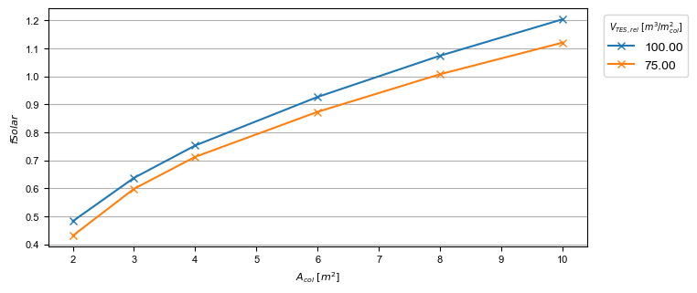
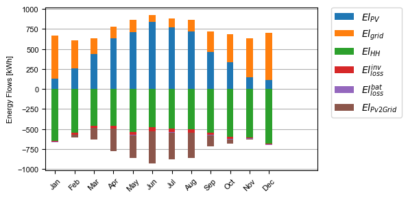
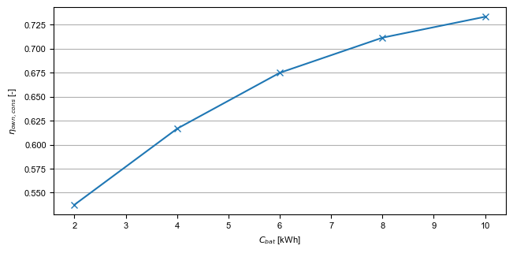

.. _examleSystems:

Example systems
===============
At the moment, pytrnsys offers two example systems that show the capabilities of the framework.
Other example systems will be added in the future. Follow the project on github to stay updated
on new releases.

Solar domestic hot water system for single family house
-------------------------------------------------------
This system is used as the demo system for the tutorial on this webpage. It has the following system hydraulics:

.. image:: ./resources/solar_dhw_diagram.png
      :width: 600
      :alt: solar dhw diagram

The system is build using the following ddck files::

    string PYTRNSYS$ "..\..\pytrnsys_ddck\"
    string LOCAL$ ".\"

    PYTRNSYS$ generic\head
    PYTRNSYS$ demands\dhw\dhw_sfh_task44
    PYTRNSYS$ weather\weather_data_base
    PYTRNSYS$ weather\SIA\normal\CitySMA_dryN
    PYTRNSYS$ solar_collector\type1\database\type1_constants_CobraAK2_8V
    PYTRNSYS$ solar_collector\type1\type1
    LOCAL$ solar_dhw_control
    LOCAL$ solar_dhw_storage1
    LOCAL$ solar_dhw_hydraulic
    LOCAL$ solar_dhw_control_plotter
    PYTRNSYS$ generic\end

It uses a `Cobra AK 2.8V <https://serv.spf.ch/spftesting/collectors/pdfs/scf1591de.pdf>`_ solar thermal collector.
The collector area is used for a parametric study and varied in a range between 2 m\ :sup:`2` and 10 m\ :sup:`2`.
The size of the thermal storage is defined relatively to the collector. In the parametric study the two sizings
75 l/m\ :sup:`2` and 100 l/m\ :sup:`2` are used. The domestic hot water demand is taken from the
`IEA Task 44 <https://task44.iea-shc.org/Data/Sites/1/publications/T44A38_Rep_C1_A_BoundaryConditions_Final_Revised.pdf>`_.
The weather data is taken from the swiss standard reference year of Zurich.

The monthly balance of the system with 6 m\ :sup:`2` collector area and a 75 l/m\ :sup:`2`
looks like this:

.. image:: ./resources/HeatMonthly.png
      :width: 600
      :alt: Monthly heat balance

The comparison plot of the parametric study showing the solar fraction looks like:

PV system with battery
----------------------

This system showcases the capability of pytrnsys to simulate PV systems. Since it does not contain any hydraulic
components, no hydraulics file is necessary. The following ddcks are used::

    string PYTRNSYS$ "..\..\pytrnsys_ddck\"
    PYTRNSYS$ generic\head
    PYTRNSYS$ demands\electricity\elDemand
    PYTRNSYS$ weather\weather_data_base
    PYTRNSYS$ weather\SIA\Normal\CitySMA_dryN
    PYTRNSYS$ pv\type194\type194
    PYTRNSYS$ pv\type194\database\sunskin_roof_module_eternit
    PYTRNSYS$ pv\type194\database\fronius_symo_inverter
    PYTRNSYS$ battery\basic_battery
    PYTRNSYS$ generic\end

The system simulates a 5.7 kWp in roof PV installation with an household electricity demand of
6568 kWh. The automatically generated electrical energy balance for the system including a battery
with a usable capacity of 6 kWh is:

A parametric study on the capacity of the used battery is defined for a range of the
usable battery capacity of 2 kWh to 10 kWh. The resulting own consumption rate for the different
battery capacities is

