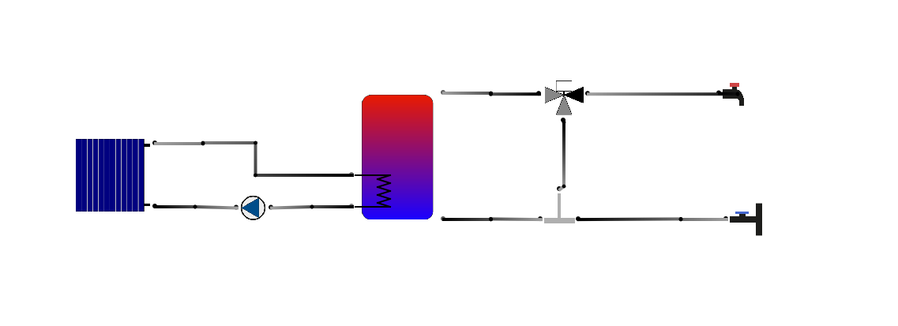
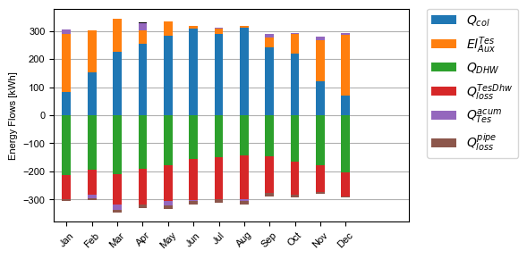
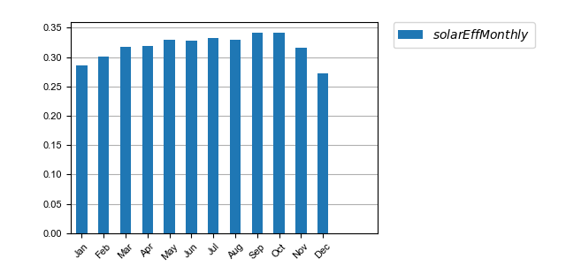
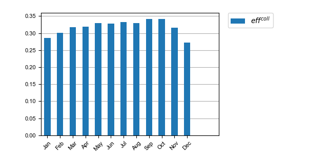

.. _tutorial:

Tutorial
========

If you correctly installed pytrnsys and were able to use the two commands ``pytrnsys-run``
and ``pytrnsys-process`` you most likely already simulated and processed your first system with pytrnsys.
But for sure you would like to adapt the example system two your weather data and to your
demand profile, excecute other parametric studies, use different system sizing, analyse other
simulation results etc. In this tutorial you learn how to do all this and much more. We will work with the
solar domestic hot water example system that looks like this:

Create your own local system
----------------------------

You can set up a local copy of the pytrnsys example systems and the pytrnsys ddck-repository by executing
``pytrnsys-load`` in the target folder of your choice. This process is explained in the :any:`getting started section <trnsys-load>`.
Once you have done this you should see a sub-folder pytrnsys_examples that contains the following files
::

    pytrnsys_examples
    +-- solar_dhw
        +--latexNames.json
        +--process_solar_dhw.config
        +--run_solar_dhw.config
        +--solar_dhw_control.ddck
        +--solar_dhw_control_plotter.ddck
        +--solar_dhw_hydraulic.ddck
        +--solar_dhw_storage1.ddck

Besides the two configuration files, the folder contains as well some ddck files that are custom to
the project. The file latexNames.json contains a dictionary that is used to translate TRNSYS variable names into
latex format usd in the results pdf-file.

If this system is executed with ``pytrnsys-run``, a new simulation folder with the name solar_dhw is created that has the following
structure::

    solar_dhw (simulation base folder)
    +-- debugParralelRun.dat
    +-- runLogFile.config
    +-- SFH_DHW.dck
    +-- UnitsType.info
    +-- (location of comparison plots)
    +-- SFH_DHW-Ac2-VTes75 (simulation sub folder)
        +--SFH_DHW-Ac2-VTes75.dck
        +--SFH_DHW-Ac2-VTes75.log
        +--SFH_DHW-Ac2-VTes75.lst
        +-- (location of single simulation results and plots)
        +--temp
           +--*.Prt

As you can see, pytrnsys creates a base dck-file SFH_DHW.dck that is then copied to the subfolders where
the actual dck-file containing all changes that were defined in the configuration file are included. So in
a parametric study, each single simulation will have its own sub-folder. In the temp folder of each sub-folder,
the simulation results defined in the TRNSYS printers will be stored.

The finished simulation results can be processed with running ``pytrnsys-process`` inside the base simulation folder
solar_dhw. The processing will add various files to the folder structure. Single simulation plots and results
will be placed in the subfolders while comparison plots and comparison data will be added to the simlation base folder.

As in all pytrnsys projects, a heat balance will be produced for the solar domestic hot water example system.
The heat balance plot of the unchanged example system looks like

To have an overview of the by default created plots and result files
please go through the different simulation folder of the example system.

Work with the run-configuration file
------------------------------------
The most easy way to work with pytrnsys is to use a pre-defined system and to modify it with the configuration
files. The pytrnsys configuration files offer a large amount of functionalities that are described in detail in
in the :any:`config file page <config_file>`. In the following sections, some of the most important functions
are explained as a step-by-step guide.

Change TRNSYS variables
^^^^^^^^^^^^^^^^^^^^^^^
Constants and Equation of the TRNSYS dck-file can be changed by the following line in the config file::

    deck trnsysVariableName value

In run_solar_dhw.config we can see that there are already three such lines that change the dck-file::

    deck START 0    # 0 is midnight new year
    deck STOP  8760 #
    deck sizeAux 3

It is recommended to always have the START and STOP variable exposed in the configuration file since they define
the simulated timespan and are of high importance. In addition the variable sizeAux is changed to a value of 3.
This variable defines the power in kW of the auxiliary heater inside the thermal storage. We can chose now any other
variable in one of the used ddck-files that we would like to change. Let's say we would like to change the slope of the
thermal collector. In order to identify the relevant parameter we have to open the ddck of the used solar collector model
/solar_collector/type1.ddck. In there we see that the collector surface definition is a dependency of another ddck
by looking at the dependency list we see that the definition of the user surface 1 that is used for the collector
is in the file /weather/weather_data_base.ddck. Inside we see that the variable we have to modify is **slopeSurfUser_1**.
Therefore, in the configfile we can add the following line to simulate a facade collector with slope 90::

    deck slopeSurfUser_1 90

If we would like to add the collector slope to the parametric study, we can use the ``variation`` keyword::

    variation slopeSurfUser_1 30 45 60 75 90

When this line is added without removing any of the other variation-lines the total amount of simulations
will increase to 6x2x5=60 which will take a while. Feel free to readuce the number of values per variation to save time.

Change the used ddck-files
^^^^^^^^^^^^^^^^^^^^^^^^^^
In the solar domestic hot water system, the following ddcks are used by default::

    string PYTRNSYS$ "..\..\pytrnsys_ddck\"
    string LOCAL$ ".\"

    PYTRNSYS$ generic\head
    PYTRNSYS$ demands\dhw\dhw_sfh_task44
    PYTRNSYS$ weather\weather_data_base
    PYTRNSYS$ weather\SIA\normal\CitySMA_dryN
    PYTRNSYS$ solar_collector\type1\database\type1_constants_CobraAK2_8V
    PYTRNSYS$ solar_collector\type1\type1
    LOCAL$ solar_dhw_control
    LOCAL$ solar_dhw_storage1
    LOCAL$ solar_dhw_hydraulic
    LOCAL$ solar_dhw_control_plotter
    PYTRNSYS$ generic\end

In pytrnsys it is possible to replace some of the ddck. In this case, it is possible to replace the domestic hot water
with another demand as well as to chose another weather data location. The current city which is Zurich (SMA) can
be replaced with Locarno in the south of Switzerland. In Locarno, there are more hours of sunlight in the year
which will help us to have a better performance for the solar domestic hot water system. In the default database pytrnsys-ddck
there are many different Swiss cities. Locarno can be chosen by::

    PYTRNSYS$ weather\SIA\normal\CityOTL_dryN

Run the modified configuration file
^^^^^^^^^^^^^^^^^^^^^^^^^^^^^^^^^^^
Now you are almost ready to run your new simulation. In order to not overwrite the default system run you should
specify a new folder name. This can be done by changing the ``addResultsFolder`` parameter::

    string addResultsFolder "my_new_solar_dhw"

Save you configuration file and use it with the ``pytrnsys-run`` command to start the simulation.

Work with the processing-configuration file
-------------------------------------------

In the default example system processing file, there are already some custom calculations and custom
plots given as examples. In this section be will go through the process of adding some more caluclations
and plot the results of the custom calculations.

Add custom calculations to the processing
^^^^^^^^^^^^^^^^^^^^^^^^^^^^^^^^^^^^^^^^^

In the default processing configuration file of the solar domestic hot water system
the monthly and overall solar fraction of the system is calculated::

    calcMonthly fSolarMonthly = qSysIn_Collector/qSysOut_DhwDemand
    calc fSolar = qSysIn_Collector_Tot/qSysOut_DhwDemand_Tot

Another interesting quantity to analyze the performance of a solar system is the Total Solar Efficiency

.. math::

    \frac{Q^{collector}}{E_{irradiance}}

This can be imlemented using the simulation results. In the monthly printer section of the collector
ddck-file /solar_collector/ype1/type1.ddck we can see that the power gain and the irradiated power per area are integrated
and printed and accessible in the processing as **PColl_kWm2** and **IT_Coll_kWm2**. So we have everything
to calculate the Solar Efficiency. Again we calculate the monthly values as well as the overal yearly value::

    calcMonthly solarEffMonthly = PColl_kWm2/IT_Coll_kWm2
    calc solarEff = PColl_kWm2_Tot/IT_Coll_kWm2_Tot

Add custom plots to the processing
^^^^^^^^^^^^^^^^^^^^^^^^^^^^^^^^^^

We can plot the new results in different ways. First of all we can use the monthly values to create
a monthly bar plot by inculding::

    stringArray monthlyBars "solarEffMonthly"

This will result in a plot that looks like this:

By default, pytrnsys will use the variable name in all the legends. We can change this to a nicer looking
LaTeX-formatted string by adding an entry to the dictionary in the projects latexNames.json. Adding a line "effSolarMonthly": "$eff^{coll}$"
in the json-file and rerunning the processing will give a plot with a nicer legend:

We can also create a comparison plot of the

Do parametric runs with different ddcks
^^^^^^^^^^^^^^^^^^^^^^^^^^^^^^^^^^^^^^^

For some tasks it is not enough to replace a single number in the dck-file. Such tasks are for example
the replacement of the weather data, to replacement the demand data or the change of the parametrization of a componenet i.e.
the solar collector. In pytrnsys this is solved by the possibility to define a seperate ddck for each cäse
and to loop though the ddcks during the parametric runs.

Let's say that instead of changing the collector slope in our example system, we would like to use different
domestic hot water profiles. In the default ddck repository pytrnsys offers both a domestic hot water profile for a single
family house as well as one for a multi family building. If we would like to include both in the same
parametric run we can include the fôllowing line::

    changeDDckFile dhw_sfh_task44 dhw_sfh_task44 dhw_mfh

The ``changeDDckFile`` command interprets the first argument as the substring to be replaced in the
ddck including line of the configuration file which in this case would be the following::

    PYTRNSYS$ demands\dhw\dhw_sfh_task44

This line will internally be changed to the following arguments of ``changeDDckFile``.
Since the first argument is repeated, an unchanged variation will be used. The third argument will
result in a variation that builds the dck-file based on the line changed to::

    PYTRNSYS$ demands\dhw\dhw_mfh

There is no restriction to the substrings used. It is also possible to write::

    changeDDckFile \dhw\dhw_sfh_task44 dhw\dhw_sfh_task44 dhw\dhw_mfh

That way ddck-files that are located in other folders could be used. The file name of the changed
ddck-file will be used in the variation's subfolder's name as well as saved to the results json-file.

Use the scaling functionality
-----------------------------

Now that we changed the demand profiles of the simulation, we will end up with very different solar
fractions for the two cases since a solar collector field that is designed for a single family home
will be much to small for a multi family building. In reality, it is a standard procedure to size the
collector field relative two the expected demand.

In order to define relative sizings, pytrnsys offers to possibility to read in the results file of
an earlier simulation run and to use the values as a scaling parameter. In our case this requires,
that we pre-run the simulation in order to find the exact domestic hot water demand of the two different
profiles. We can do this by running a confguration file that consists of no other variations but
the :ref:`changeDDckFiles` line defined in the previous chapter::

    changeDDckFile dhw_sfh_task44 dhw_sfh_task44 dhw_mfh

This should result in a simulation folder with the following subfolders::

    solar_dhw (simulation base folder)
    +-- SFH_DHW-dhw_mfh (simulation sub folder)
    +-- SFH_DHW-dhw_sfh_task44 (simulation sub folder)

Before we are able to process we should make sure that we add the simulation result, that we would like
to use for scaling to the results file. In our case this is the yearly sum of the monthly
integrated and printed values of **P_dhw_kW** that are by default available in the
processing as **P_dhw_kW_Tot**. So in the results file definition line we add::

    stringArray results  "Pdhw_kW_Tot" "**" "**"

We now have our simlation results ready to be used in the scaling. The scaling can be activated by
setting the :term:`ignoreOnlinePlotter` parameter in the run configuration file from **"False"** to **"toDemand"**.
We then have to tell pytrnsys where it can find the scaling values. This is done by adding the following line::

    string scalingReference "absolutePathToYourBaseResltsFile\SFH_DHW-dhw_sfh_task44-results.json"

The argument of the parameter :term:`scalingReference` should be the results json-file of the simulation
that corresponds to the first argument of the ``changeDDckFiles`` line. For each ddck-variation defined in
``changeDDckFiles`` Pytrnsys will take the file names and do the same substring replacement in
the path in ``scalingReference``. When the folder with the scaling values is onmodified, pytrnsys should
be able to find the correct values for each variation.

Finally, we should pytrnsys also tell which value in the results file it should use. We can do this
by adding the following line::

    string scalingVariable "Pdhw_kW_Tot/1000"

As you can see we can also add arithmetic operations to the value. As en example, here the value is converrted
from kW to MW.

We are now ready to define our parametric study using relative sizing of parameters. As soon as the scaling is
set to **"toDemand"**, pytrnsys will always multiply the values given in the ``variation`` statement
with the scaling variable. So we can now size our collector area with relative to the domestic hot water demand.
A realistic sizing would be to have about :math:`1.5 m^2\MWh` so we add slight variations as::

    variation Ac AcollAp 1 1.5 2

This will finally result in a more insightful comparison plot for the solar fraction:

Create your own ddck files
--------------------------

Get access to the pytrnsys GUI
------------------------------

